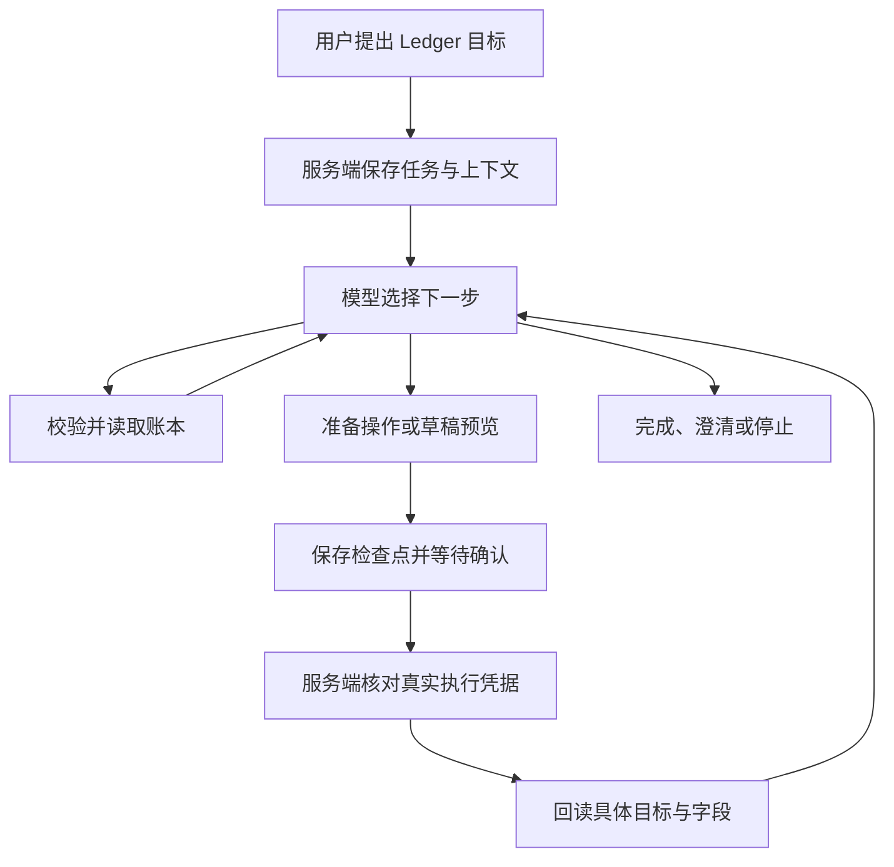

# Ledger Agent

AI 对话记账现在使用限定在 Ledger 内的任务循环。用户描述目标，模型选择账本工具，服务端校验并读取数据，将结果返回模型，再决定下一步。普通记账仍直接生成待确认草稿；保存、修改、删除及关联保持预览批准。

## 运行路径



主入口是 `POST /api/assistant/tasks`，普通文字任务启用 agent；截图分批识别和明确选择的钱款事项继续使用已有专用流程。`/api/assistant` 直接调用保持原协议兼容。

模型通过结构化步骤选择 `read/query`、`read/records`、`preview/command`、`preview/event` 或 `respond`。前者读取账本，预览工具只能准备审批，不能批准或执行。业务金额、日期、成员、分类和关联校验继续由现有业务函数处理。工具没有 SQL、终端、外部网络、真实付款或账户设置能力。

单次最多 8 次模型决策，整个目标累计最多 24 步；运行时间通常为 75 秒，单次模型请求最多 60 秒。私有检查点和单项工具结果分别有大小上限。达到限额后明确停止或请求缩小范围，不能将中间结果冒充完成。

## 上下文、确认和恢复

服务端保存原请求、模型步骤、工具结果、待确认计划、预览指纹及执行凭据。历史对话和记录是数据，不授予新操作或批准权限。后续任务可读取当前会话的有限历史目标、记录引用和真实操作凭据；这不是跨会话的个人偏好记忆。

待确认的完整计划也存入检查点，包括服务器生成的草稿 ID。即使检查点已保存、最终任务响应丢失，重试仍恢复同一张卡片。预览 ID 由用户、会话、目标和操作指纹确定；同一预览不会因响应丢失而重新创建。

确认后客户端调用 `PATCH /api/assistant/tasks/:id`，内容为 `{ "action": "resume", "attempt": 当前版本 }`。浏览器不能提交可信的执行结果；服务端从已绑定的审批或入账批次读取实际结果，检查归属、会话、版本和目标，再增加任务版本继续。重复恢复请求不会重复执行。尚未确认或结果仍在执行中的任务不触发新的模型调用。

批准操作会返回实际受影响记录的 ID。恢复前，服务端按这些 ID 回读并校验新增、修改字段或删除结果，以及钱款事项的流水关联。日期由数据库格式化为日历日期，避免本地时区改变日期。数据已经变化或结果未知时停止自动推进，保留执行凭据供核对。跨查询差额以整数分计算，模型不自行估算金额。

取消会停止后续处理和待执行预览，已提交的数据保留。会话清空后的任务不能恢复。待确认任务不能通过“重试”绕过审批；正常处理失败或中止可以显式重试，旧 worker 的版本与运行令牌不能覆盖新结果。普通多条管理仍可能部分成功，执行凭据明确报告完成数量，不能自动重放。

## 界面行为

普通对话以正文展示回复，缺少信息时直接展示具体问题，不重复显示原目标或完成标签。处理过程以轻量行默认折叠在回复正文上方，可展开查看实际处理步骤，不展示提示词、内部推理或密钥。处理中展示一行进度和停止控制；待确认时沿用实际操作或账目预览，并提供停止后续处理的入口。审批后继续同一目标，之前的确认卡片、执行结果和已保存草稿仍保留。刷新会恢复原任务和审批历史。首次补充草稿成员后，保留原询问文字，依次展示用户的人员回复和核对账目卡片；移动的是同一张卡片，任务ID、草稿ID和确认批次ID保持不变，刷新和轮询不能把卡片放回人员回复之前。

能力介绍里的“调整已保存记录”“修改与删除已入账记录”描述能力和记录状态，不能误判为本次操作已完成；完成声明按分句校验，介绍能力不豁免同一回复中的无凭据成功声明。

当助手询问是否重复记录时，用户回复“新增一笔”可以引用最近相关交易的金额、用途和日期，生成独立的待确认草稿组；旧草稿保留，不视为确认入账。若模型只通过聊天声称操作已完成、没有对应草稿或执行凭据，任务反馈校验错误并允许重新生成一次；仍不一致则保留未完成状态，不能仅凭文字构造入账操作。

发送新目标保留旧目标的待确认方案；仅用户明确取消、停止任务或清空对话时取消旧方案。多个方案同时待确认时，用户需在对应卡片上操作；用户修改预览后必须核对新方案。普通新增收支每个目标使用一个最多 20 笔的确认批次；需要追加另一批新交易时另发请求，不复用已经入账的批次 ID。当前对草稿修改、删除和撤销继续使用已有卡片交互，而非自动越过用户操作。

## 模型与评测

模型沿用 `BAILIAN_ASSISTANT_MODEL`。`BAILIAN_ASSISTANT_THINKING=true` 可启用推理，推理强度由 `BAILIAN_ASSISTANT_REASONING_EFFORT` 控制；默认不增加普通记账等待时间。是否使用更强模型应以真实任务成功率、延迟和费用决定。

运行确定性回归：

```sh
node --test tests/assistant-agent-*.test.cjs
```

设置 `LEDGER_TASKS_PGLITE_MODULE` 为隔离 PGlite 包路径可执行真实 PostgreSQL 语句的集成测试；它不连接 `DATABASE_URL`。完整回归还可设置 `LEDGER_UNDO_PGLITE_MODULE` 启用原撤销 SQL 测试。

运行真实模型、沙盒工具验证：

```sh
node scripts/evaluate-assistant-agent.mjs --live
```

该脚本使用配置的百炼模型，账本工具使用合成数据，代码拒绝导入账户数据库。场景包括连续查询、记账核对、模拟确认后接续和能力边界。`--scenario ordinary_review_first_record` 可单独测试记账与接续，`--output` 指定报告文件。它会产生模型调用费用。

`assistant-agent-evaluation.json` 是评测场景规范，不是通过证明。确定性工具测试、隔离数据库集成、真实模型沙盒和浏览器验收是不同证据；少量沙盒通过不能代表所有自然语言表达都可靠，也不能代表已部署到生产。
