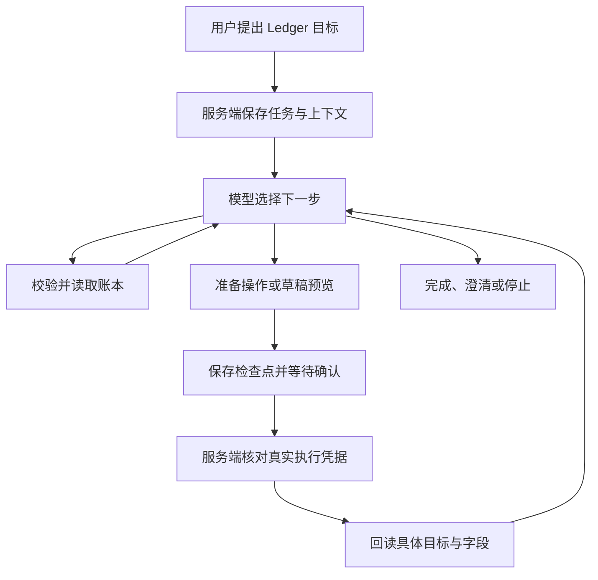

# Ledger Agent

AI 对话记账现在使用限定在 Ledger 内的任务循环。用户描述目标，模型选择账本工具，服务端校验并读取数据，将结果返回模型，再决定下一步。普通记账仍直接生成待确认草稿；保存、修改、删除及关联保持预览批准。

## 运行路径



主入口是 `POST /api/assistant/tasks`，普通文字任务启用 agent；截图分批识别和明确选择的钱款事项继续使用已有专用流程。`/api/assistant` 直接调用保持原协议兼容。

模型通过结构化步骤选择 `read/query`、`read/records`、`read/draft_matches`、`preview/command`、`preview/event` 或 `respond`。前者读取账本，预览工具只能准备审批，不能批准或执行。业务金额、日期、成员、分类和关联校验继续由现有业务函数处理。工具没有 SQL、终端、外部网络、真实付款或账户设置能力。

`read/draft_matches` 使用空参数，以登录用户范围、类型和精确整数分金额召回草稿日期前后7天的记录，再按关联证据过滤，金额相同本身不构成候选。商户名称去标点及支付前缀后相同（或至少6字符的截断前缀）才提示疑似重复；用途相关仅使用明确基金/云服务词组且日期差不超过1天，分类冲突排除。原账缺少用途时，仅分类一致、分类不是泛化的“其他/购物”、日期差不超过1天才提示资料不足。草稿已指定成员而原账成员不同则排除。未选成员不阻塞。同商户跨日期仍可能是多次消费，不判定确定重复。过滤后排序和计数，每笔最多展示三条候选，缺少金额/日期明确为未完成。卡片突出原账名称、金额、日期偏差、关联依据，提供查看原账、移除本笔草稿、保留草稿。快捷决定绑定核对时的草稿快照，草稿变更后禁用，决定可刷新恢复；只改变本地待确认草稿，不写已保存账本。

工具同时生成基于真实行数据的逐笔答复。若工具已完成、下一步模型回复格式无效，返回这份服务端答复；不丢弃读取结果、不使用模型半成品，也不执行后续写操作。由于无法验证原目标是否还包含后续工作，此降级保留 `needs_input` 状态。

单次最多 8 次模型决策，整个目标累计最多 24 步；运行时间通常为 75 秒，单次模型请求最多 60 秒。私有检查点和单项工具结果分别有大小上限。达到限额后明确停止或请求缩小范围，不能将中间结果冒充完成。

## 上下文、确认和恢复

服务端保存原请求、模型步骤、工具结果、待确认计划、预览指纹及执行凭据。历史对话和记录是数据，不授予新操作或批准权限。后续任务可读取当前会话的有限历史目标、记录引用和真实操作凭据；这不是跨会话的个人偏好记忆。

待确认的完整计划也存入检查点，包括服务器生成的草稿 ID。即使检查点已保存、最终任务响应丢失，重试仍恢复同一张卡片。预览 ID 由用户、会话、目标和操作指纹确定；同一预览不会因响应丢失而重新创建。

确认后客户端调用 `PATCH /api/assistant/tasks/:id`，内容为 `{ "action": "resume", "attempt": 当前版本 }`。浏览器不能提交可信的执行结果；服务端从已绑定的审批或入账批次读取实际结果，检查归属、会话、版本和目标，再增加任务版本继续。重复恢复请求不会重复执行。尚未确认或结果仍在执行中的任务不触发新的模型调用。

批准操作会返回实际受影响记录的 ID。恢复前，服务端按这些 ID 回读并校验新增、修改字段或删除结果，以及钱款事项的流水关联。日期由数据库格式化为日历日期，避免本地时区改变日期。数据已经变化或结果未知时停止自动推进，保留执行凭据供核对。跨查询差额以整数分计算，模型不自行估算金额。

取消会停止后续处理和待执行预览，已提交的数据保留。会话清空后的任务不能恢复。待确认任务不能通过“重试”绕过审批；正常处理失败或中止可以显式重试，旧 worker 的版本与运行令牌不能覆盖新结果。普通多条管理仍可能部分成功，执行凭据明确报告完成数量，不能自动重放。

## 界面行为

普通对话以正文展示回复，缺少信息时直接展示具体问题，不重复显示原目标或完成标签。处理过程以轻量行默认折叠在回复正文上方，可展开查看实际处理步骤，不展示提示词、内部推理或密钥。处理中展示一行进度和停止控制；待确认时沿用实际操作或账目预览，并提供停止后续处理的入口。审批后继续同一目标，之前的确认卡片、执行结果和已保存草稿仍保留。刷新会恢复原任务和审批历史。首次补充草稿成员后，保留原询问文字，依次展示用户的人员回复和核对账目卡片；移动的是同一张卡片，任务ID、草稿ID和确认批次ID保持不变，刷新和轮询不能把卡片放回人员回复之前。

能力介绍里的“调整已保存记录”“修改与删除已入账记录”描述能力和记录状态，不能误判为本次操作已完成；完成声明按分句校验，介绍能力不豁免同一回复中的无凭据成功声明。

当助手询问是否重复记录时，用户回复“新增一笔”可以引用最近相关交易的金额、用途和日期，生成独立的待确认草稿组；旧草稿保留，不视为确认入账。若模型只通过聊天声称操作已完成、没有对应草稿或执行凭据，任务反馈校验错误并允许重新生成一次；仍不一致则保留未完成状态，不能仅凭文字构造入账操作。

发送新目标保留旧目标的待确认方案；仅用户明确取消、停止任务或清空对话时取消旧方案。多个方案同时待确认时，用户需在对应卡片上操作；用户修改预览后必须核对新方案。普通新增收支每个目标使用一个最多 20 笔的确认批次；需要追加另一批新交易时另发请求，不复用已经入账的批次 ID。当前对草稿修改、删除和撤销继续使用已有卡片交互，而非自动越过用户操作。

通过对话成功修改待确认草稿的日期、金额、成员或顺序后，将原批次卡片移到修改回复下方；旧位置显示“已更新 · 查看最新卡片”。每个历史入口直接指向原批次 ID，反复修改后仍只有一张可操作卡片，点击入口仅滚动并短暂高亮，不执行入账。选人成功后的旧位置同样保留入口。刷新和任务轮询保留卡片顺序与最新字段；手动在卡片内编辑保持原位，避免打断输入。

## 模型与评测

模型沿用 `BAILIAN_ASSISTANT_MODEL`。`BAILIAN_ASSISTANT_THINKING=true` 可启用推理，推理强度由 `BAILIAN_ASSISTANT_REASONING_EFFORT` 控制；默认不增加普通记账等待时间。是否使用更强模型应以真实任务成功率、延迟和费用决定。

运行确定性回归：

```sh
node --test tests/assistant-agent-*.test.cjs
```

设置 `LEDGER_TASKS_PGLITE_MODULE` 为隔离 PGlite 包路径可执行真实 PostgreSQL 语句的集成测试；它不连接 `DATABASE_URL`。完整回归还可设置 `LEDGER_UNDO_PGLITE_MODULE` 启用原撤销 SQL 测试。

运行真实模型、沙盒工具验证：

```sh
node scripts/evaluate-assistant-agent.mjs --live
```

该脚本使用配置的百炼模型，账本工具使用合成数据，代码拒绝导入账户数据库。场景包括连续查询、记账核对、模拟确认后接续和能力边界。`--scenario ordinary_review_first_record` 可单独测试记账与接续，`--output` 指定报告文件。它会产生模型调用费用。

`assistant-agent-evaluation.json` 是评测场景规范，不是通过证明。确定性工具测试、隔离数据库集成、真实模型沙盒和浏览器验收是不同证据；少量沙盒通过不能代表所有自然语言表达都可靠，也不能代表已部署到生产。

待确认草稿的 `remove` 直接在同一组账目卡片标记 `softRemoved`，保留原始行、字段、ID和显示顺序，允许单笔或整组恢复。批量移除的对话结果将同一张卡片移到最新回复下，历史位置只保留跳转入口，不另生成移除审批卡。合计、成员补充、查重上下文和入账载荷均排除软移除行；全部移除时仍保留卡片并禁用入账。刷新保留标记，旧移除审批按原快照迁移，过期或已变化的方案不改动草稿。确认成功后的已入账卡片仅展示实际提交行，已保存账本的删除审批不变。

截图识别将可见事实提取与最终入账分开：日期、人民币金额、正负方向完整的转账、借还字样、红包及独立正数退款行均可生成待确认草稿；用途或分类未知时保留原描述并在 note 提示，分类可为空，不阻塞整张识别，不推断成工资、礼金或借还事件。确实缺必要金额、日期、币种或方向仍需澄清。分类和成员校验仍在确认入账时执行。分批版本升级至 target-image-v5，避免重试混用旧提示词结果。

卡片更新统一使用历史位置占位和最新卡片跳转：草稿更正/成员选择/排序，送礼和借还待确认方案更正，管理方案更正，查询纠正，已保存流水同步及审批重新生成均保留单一最新入口。对话更正只替换明确关联的方案，不合并新增的独立事项；旧审批只执行取消，不执行批准，停用确认前阻止新方案执行。多次更正将所有旧入口指向最新版，过期任务回放不恢复旧按钮。直接在当前表单输入时保留焦点，不因每次键入移动卡片。
